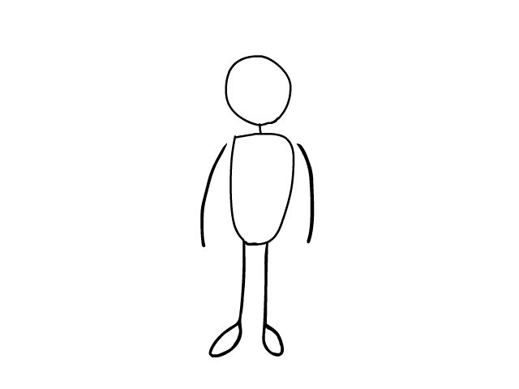

## Hello there! 

I am a self-taught programmer who is currently a student. I've sailed into the world of programming through modding and scripting for the Half-Life Gold Source engine around 10 years ago, and then later moved to backend web development. I've worked with numerous technologies and projects, but I still think of myself as a humble beginner and I want to learn more and get better.

- 🔭 I’m currently working on: [Minecraft Console Client](https://github.com/MCCTeam/Minecraft-Console-Client)
- 🌱 I’m currently learning: 
- 👯 I’m looking to collaborate on: Open Source projects which make life easier
- 📫 How to reach me: milutinke [at] gmx.com

## 🚀💻 Technologies & Tools

#### Utilized (Not mastered completely, learned just enough to utilize):

#### Looking forward to learn:

## ⚙️ Git Stats

 

